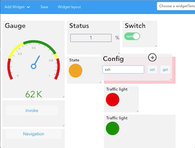
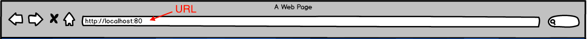
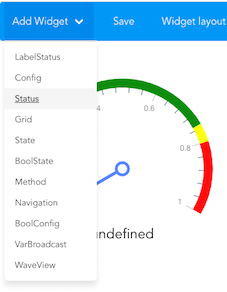
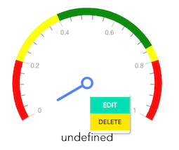
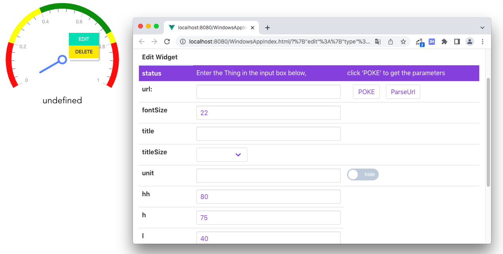
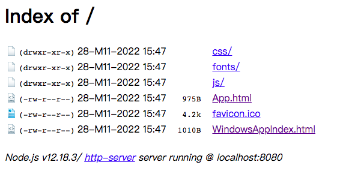
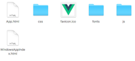
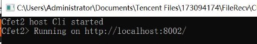
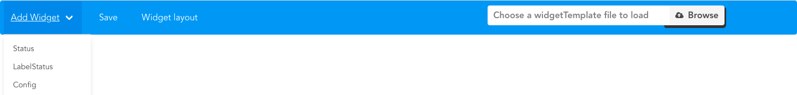

# Introduction

  

  
  
  
  

## What is CFET WidgetUI ?

> CFET WidgetUI is a **front-end component framework software** of CFET; is also a ``website``.

WigetUI提供了一系列的图形化组件，比如仪表盘，label等等，这些组件向用户开放图形化编辑功能，可以编辑组件对应的资源的url，以及组件的样式颜色修改，部分功能选择等

Unlike other monolithic frameworks and Websites, CFET WidgetUI allows three application roles to use it, namely ``Core Developer``, ``App Developer`` and ``User``.

* For Core Developer: **You are required to master how to control your Equipment with CFET.** And know how to access the resource. You can also develop a new Widget in code.

* For App Developer: You just be asked to focus on how to access the resource with ``URI``(All the resource and function in CFET can be accessed with URI which also means Route). **All the URI you need will be listed on the back end console from the Core Developer.** 
And more importantly, you should learn how to ``build and save user interfaces`` through the operation on the website.

  
  

* For User: **The only thing you have to do is open Chrome, and enter the URL(that App Developer told you) to visit the website.**  Then you can monitor and operate all the things you need in the control system.

---

## VueGrid

如图，用户可以点击`Add widget`按钮选择需要的组件，点击`widget layout`按钮页面进入编辑模式，在编辑模式中，用户点击灰色部分可以移动组件在界面中的位置，按住灰色方块右下角的箭头，可以放大和缩小组件，然后点击页面空白处，退出编辑模式，退出编辑模式之后，灰色的阴影会消失，得到一个全新的用户界面

## EditWindow

在widget的组件范围内，点击鼠标右键，会出现鼠标右键菜单，里面有`EDIT`和`WELETE`两个按钮，点击DELETE删除组件，点击EDIT会唤醒edit窗口，也是一个网页

几乎每个widget都有`url`以及`POKE`和`ParseUrl`这几个配置。在cfet中，url对应资源数据，比如103有3组灯，现在要访问103的灯的开关状态，而这个cfet程序跑在ip为192.168.0.10的8002端口。
如果要访问第一组，url这里填写的则是：http://192.168.0.10:8002/103/light/1，此时1是参数。

点击POKE表示，你只知道资源对应的路径，不知道访问该资源需要什么参数配置，点击poke会在windows中显示你需要配置的参数。
点击ParseUrl表示，你知道完整的资源路径，你可以直接输入完整带参数的url。或者你需要使用relay这类特殊的thing，这类thing的url本身不是合法的url，或者你需要自己定义一些参数，自己定义的参数只需要在参数前后添加$。
比如url填写http://192.168.0.10:8002/103/light/$group$，点击parseurl之后，会在windows界面显示group的参数名和对应的输入框，在输入框中输入数据，再点击apply，和直接输入完全的路径点击parseurl之后点击apply是一样的效果，这只是图形化的优化。

## Widget基类
> Widget基类是所有widget的父类，widget继承widget base。

基类里面有一些基础的功能函数，比如，通过url获取数据，更新widget视图，解析和拼接参数，保存界面，广播等等通用功能

---

## Getting Started

>The main difference between Core Developer and App Developer is whether the back-end control program is written by yourself. For CFET WidgetUI, unless the former wants to program, the difference between the two roles is not significant. ``It is assumed that everyone already knows what kind of URL there is and knows its corresponding meaning.``

*I will introduce the homepage and the usage of each Widget. Different Widgets will be written into corresponding documents separately. Only the basic usage of the homepage will be introduced here.*

### 如何运行？
WidgetUI有两个入口page，所以编译出来对应两个html文件，分别是App.html以及WindowsAppIndex.html。其中WindowsAppIndex对应的就是上面提到的Edit窗口。

npm安装http-server，进入html同级目录后，输入命令行http-server . -p 8080，在8080端口跑起来，此时直接访问localhost:8080，会进入

，点击相应的html进入界面
推荐直接输入`localhost:8080/App.html`进入主页面，然后通过右键编辑组件的方式访问WindowsAppIndex

### 如何装环境&调试

环境搭建：
进入项目目录package.json目录，运行`npm install`

调试：
运行`npm run serve`，如果需要联动后台调试，则在vue.config.js文件中配置后台的ip+port，然后再运行npm run serve即可

### 如何打包构建
在vue.config.js文件中配置输出路径，然后在项目路径下运行
`npm run build`

观察是否生成相应文件，有时候会有报错，但是只要正常生成就可以正常使用。

### 如何集合到CFET APP中

把生成的文件夹改名为views，再把App.html改名为index.html，放到CFET APP运行目录下。
- [x] ``Get in WidgetUI Website``

   The front-end website is mounted on CFET, after running the CFET APP, you will see a console like this.

   

   It will tell you which port CFET WidgetUI is running on, copy this url and visit it with a browser, you can get the website directly.

    比如运行这个cfet app的ip是192.168.1.10，那么访问WidgetUI只需要在浏览器输入http://192.168.1.10:8002，cfet会自动重定向到WidgetUI

- [x] ``basic usage of the homepage``

   The leftmost side of the navigation bar is ADD Widget. You can select and click the required Widget, the Widget will appear on the web page.

  

  Click on the Widget layout button to enter the edit mode, in this mode there will be a gray frame around Widge.

  

  You can drag, move, zoom in and out, configure the style and composition of the user interface. When you finish the configuration, click on the blank area of the page to launch the edit mode.

  **Then you can click the save button to save the configured interface.**

  The interface will be saved as a json file, you can choose to save it in the specified path of your computer or in the CFET APP.

  > ``save it in the specified path of your computer：``
   
   Click the load button on the right side of the navigation bar and select the corresponding json file to get the user interface

  > ``save it in the CFET APP:``
   
   Mount Customview Thing under the execution folder of CFET APP, then save and configure the json file. When running CFET APP again, the user can get the corresponding user interface through url+interface name, like http://localhost:8002/userInterface1
  
    把json复制到CFET app下的CustomView文件夹下，该文件夹里面有一个CustomViewConfig.json的配置文件，json文件的key支持正则表达式，对应的是用户在输入url的时候输入的界面名称，value对应的是保存下来的json文件名称。
    
    比如，用户搭建了一个专门用来管理排灯的界面，点击界面上的save按钮之后，会获得一个json文件，命名为light.json
    然后把light.json复制到CFETAPP的CustomView文件夹下，同时更改CustomViewConfig.json里面的配置，如增加一行："lights":"light.json"
    
    然后重新运行CFET APP，访问http://192.168.1.10:8002/lights，就可以获得排灯界面
    
    #### CustomView路径替换
    这个功能有点难理解，我先解释一下背景
    比如我们有三个灯，分别对应/103/light1，/103/light2和/103/light3
    这三个灯需要的界面是一摸一样的，只是对应的资源路径不同，如果按照一个灯一个json文件，那就要配置3次几乎一样的界面，如果有100个灯就要配置100次，太折腾了
    
    所以，我们在搭建用户界面的时候，把路径不同的地方，配置成/103/$startpath$，然后再点击save按钮，保存成json，同时更改CustomViewConfig.json里面的配置，如增加一行："light[1-3]":"light.json"
    
    然后重新运行CFET APP，访问http://192.168.1.10:8002/light1，就会获得资源路径为light1的界面，比如是访问http://192.168.1.10:8002/light2，则会获得资源路径为light2的界面
    
    这样相同的界面不需要配置多次
    
    * **`注意：保存之后如果要在之前的界面上更改url配置，需要再点击poke或者parseUrl，否则有些中间处理的数据可能还是上一次保存的旧数据`**
---

## Wigets

* [Status](./src/components/Status/README/Status.md)
* [Config](./src/components/Config/README/Config.md)
* [Navigation](./src/components/Navigation/README/Navigation.md)
* [Method](./src/components/Method/README/Method.md)
* [Broadcast](./src/components/Broadcast/README/Broadcast.md)

## 开发者技术文档

对于新接手WidgetUI的同学，建议的学习路径如下：

* 首先理解cfet基础的概念，比如cr，thing等等

* 运行cfet程序，学会手动使用cr

* 了解不同的widget的作用

* 学习relay的用法和意义

* 学习代码细节

* 实现一个简单的Widget

* [技术文档](./src/components/doc/base.md)
