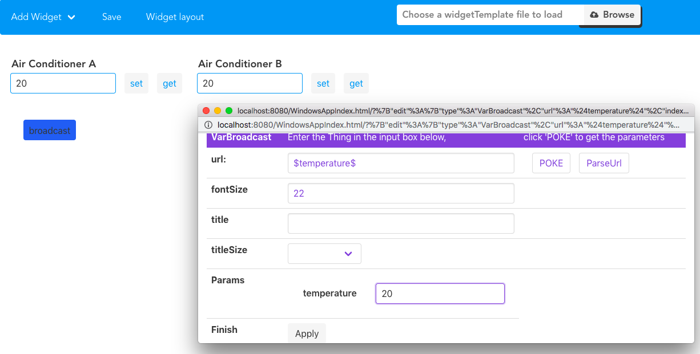
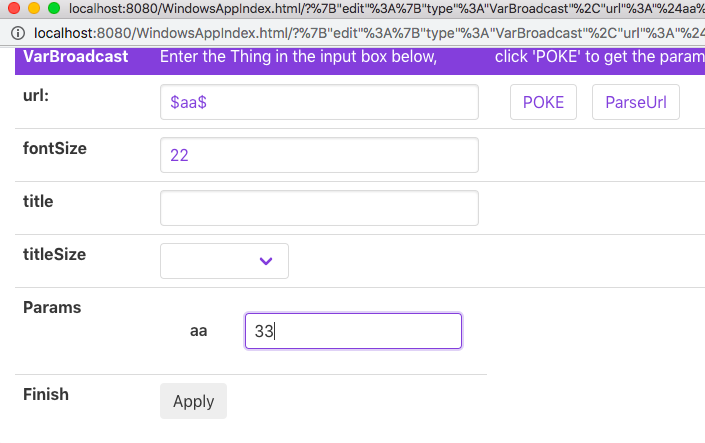
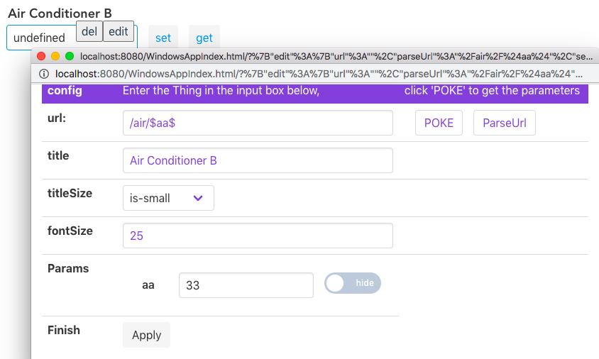

# Introduction of Broadcast

> As the name suggests, Broadcast is used to broadcast all Widgets

## Usage of Broadcast

For example, there are 200 air conditioners in a factory, all have to be set to 20 degrees Celsius. It is too troublesome to change one by one. At this time, you can broadcast the changes.

Whether the object to be changed is a value, a path, or a parameter, enter ``$the corresponding name$`` in the broadcast url, click poke button, enter the value below, and finally click apply. 

You can change ``$the corresponding parameter$`` values in all other widgets.

No matter what you want to change, as long as the value in $$ can be matched, it will be changed by broadcasting.

For example, if you want to broadcast a meaningless params named \$aa\$

When you open the Edit interface of other widgets, you find that the value of \$aa\$ has been changed.

---
