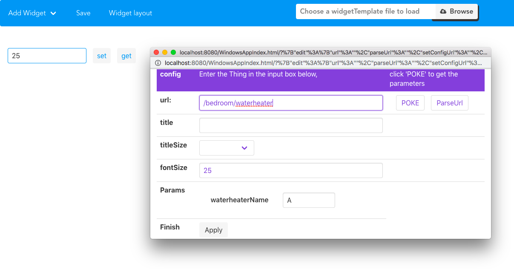
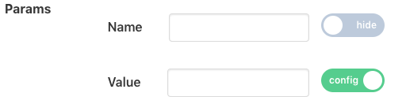
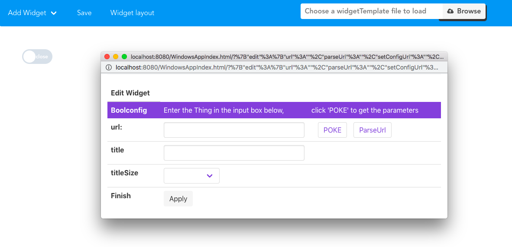
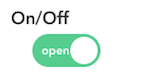

# Introduction of Config

## What is Config in CFET ?

CFET is designed to be a control systom based on the concept of 'Thing'. ``CFET abstractly encapsulates all objects to be controlled into things.`` 

>A thing may have a set of configurations. Configuration is a property that the thing it self cannot change but can only be changed by others.

***For instance**, if the air conditioner is the object you want to control, so the air conditioner is the thing in CFET, and Config is whether you need to switch the air conditioner*

---

## Usage of Config
> There are many widgets used to display Config, namely Config and boolConfig.

### Config

When you want to set the water temperature of the waterheater, but you don't know the specific path, you can just enter ``/bedroom/waterheater/``, and then click the ``poke`` button on the right, the relevant parameters will appear below.

At this time, there are two parameters of the water heater, one is the name of the water heater (used to specify which water heater you need), and the other is the set temperature of the water heater.

**Unlike status, config will extract the parameters that need to be set in the widget for display, and only display the remaining parameters in the configuration interface like this.**

``In this way, after APP Developer configures the interface, the user does not need to open the Edit interface, just set the required value in the Widget.``

> If you are a App developer who is very familiar with resources, you can directly enter the complete URL and click Apply, which is also effective.

For instance: /bedroom/waterheater/A/

> In some cases, App developers need to define some routes or parameters by themselves, but the resource return by poke is already defined. At this time, you need to use the ParseUrl button.

For instance: /relay/waterheater/\$Name\$/\$Value\$

The parameters will be parsed below.

Similarly, you need to put the parameters which need to be set in the Widget. ``Since the parameters are are defined by yourself, you have to use the switch to select which one needs to be placed outside.`` After selecting, click the App button, and the interface will be Will refresh, the parameters in the Widget Config are the parameters that need to be set, and only the remaining parameters are left in the Edit interface.

---

### BoolConfig

*There are some bool value settings, such as switching desk lamps, using boolconfig is more intuitive.*

All the rest of the logic is exactly the same as Config, but in another form of display.

---

