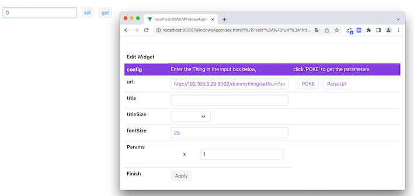
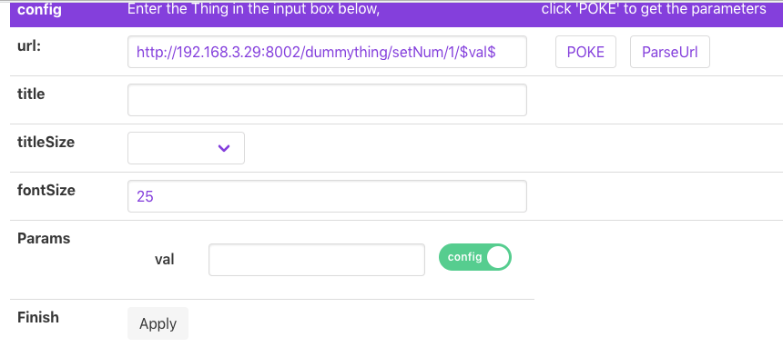
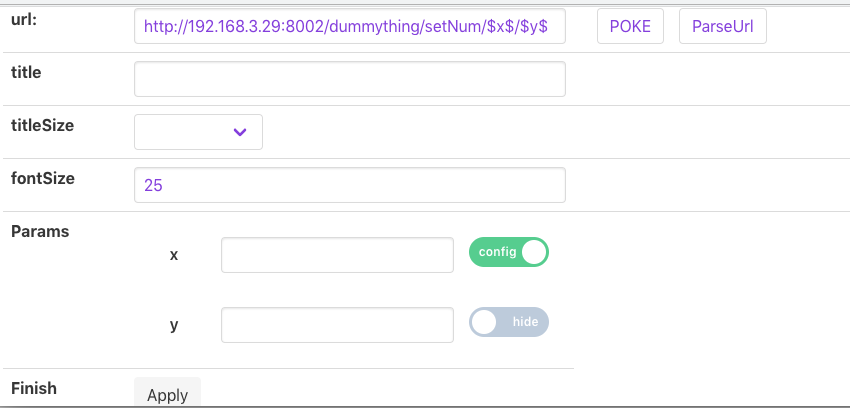
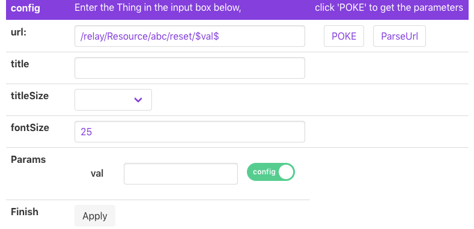

# Introduction of Config

## What is Config in CFET ?

CFET is designed to be a control systom based on the concept of 'Thing'. ``CFET abstractly encapsulates all objects to be controlled into things.`` 

>A thing may have a set of configurations. Configuration is a property that the thing it self cannot change but can only be changed by others.

***For instance**, if the air conditioner is the object you want to control, so the air conditioner is the thing in CFET, and Config is whether you need to switch the air conditioner*

---

## Usage of Config
> There are many widgets used to display Config, namely Config and boolConfig.

### Config

When you want to set the water temperature of the waterheater, but you don't know the specific path, you can just enter ``/bedroom/waterheater/``, and then click the ``poke`` button on the right, the relevant parameters will appear below.

At this time, there are two parameters of the water heater, one is the name of the water heater (used to specify which water heater you need), and the other is the set temperature of the water heater.

**Unlike status, config will extract the parameters that need to be set in the widget for display, and only display the remaining parameters in the configuration interface like this.**

``In this way, after APP Developer configures the interface, the user does not need to open the Edit interface, just set the required value in the Widget.``

> If you are a App developer who is very familiar with resources, you can directly enter the complete URL and click Apply, which is also effective.

For instance: /bedroom/waterheater/A/

> In some cases, App developers need to define some routes or parameters by themselves, but the resource return by poke is already defined. At this time, you need to use the ParseUrl button.

For instance: /relay/waterheater/\$Name\$/\$Value\$

The parameters will be parsed below.

Similarly, you need to put the parameters which need to be set in the Widget. ``Since the parameters are are defined by yourself, you have to use the switch to select which one needs to be placed outside.`` After selecting, click the App button, and the interface will be Will refresh, the parameters in the Widget Config are the parameters that need to be set, and only the remaining parameters are left in the Edit interface.

上面提到了两个按钮，一个是POKE，一个ParseUrl，这两个按钮在其他文档也多次提到，但在config中用法比较特殊，下面拿出来再详细举例讲讲：

#### POKE

对于poke来讲，用法还是比较直接，输入不带参数的url之后，点击poke
下面会出现该url对于的参数，与status不同的是，config会自动把最后一个参数提到App界面上

比如设置卧室台灯的开关，url为/bedroom/light，参数两个，分别是台灯名称和是否打开，对应后端的指令应该是 set /bedroom/light/A/1，表示把A灯打开

使用POKE只需要在url输入框输入"/dedroom/light"，点击POKE

注意，在edit窗口下方只会出现灯名这个参数，是否打开这个参数已经被提到了App中
点输入灯名，点击apply之后，用户可以直接在App页面中配置是否打开这个参数了

比如/dummything/setNum，有两个参数x和y，点击poke之后,只显示x，输入x值，点击apply之后，主页上就会显示y值了

#### ParseUrl

* ParseUrl主要的应用场景在使用relay等特殊的thing的时候使用，用户不需要或者不希望获取完全的url，需要自己定义url

* 同时ParseUrl还可以供用户在多个参数中选择用户需要的参数放在App中，而poke则是固定是最后一个参数

* 或者像前面说的，用户想直接输入完整url或则自定义参数名称，比如在url输入框输入：/bedroom/light/$key$/$val$,key和val填写A和1，
实际效果和输入/bedroom/light/A/1是一样的，key和val只是方便用户的图形化操作

比如

自己写了x值，通过parseurl，并自己命名为val，点击开关把val提出去，再点击apply即可

这样就是选择了把x提出去

##### 配置relay

`正确的做法是，输入url：/relay/Resource/abc/reset/$val$, 点击ParseUrl，把参数放到外面的开关打开，点击Apply，就可以在App界面上对/relay/Resource/abc/reset进行get和set`

---

### BoolConfig

用法和config一致，只是提出去的参数值只支持string类型的1和0，int 1和0以及bool值

*There are some bool value settings, such as switching desk lamps, using boolconfig is more intuitive.*

All the rest of the logic is exactly the same as Config, but in another form of display.

---

