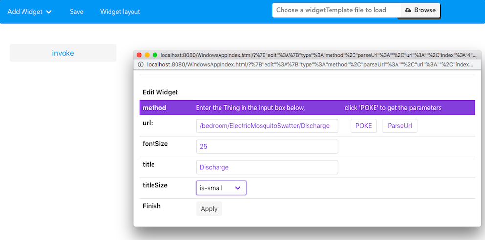

# Introduction of Method

## What is Method in CFET ?

CFET is designed to be a control systom based on the concept of 'Thing'. ``CFET abstractly encapsulates all objects to be controlled into things.`` 

>A thing may have a set of methods. A method is a command like property, like a method of member function in OOP. 

***For instance**, if the Electric mosquito swatter is the object you want to control, so the Electric mosquito swatter is the thing in CFET, So discharge is a method*

---

## Usage of Method

> The logic of Method is very simple and straightforward. 

There is a function, you need to call this function just click the button.

For example, If you want to control the electric mosquito swatter's discharge(every 10 minutes of discharge), after configuring Widget, click it, and it will discharge for 10 minutes.

