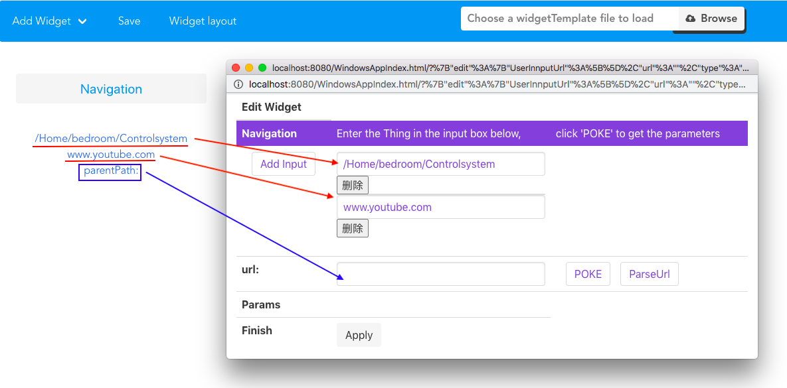

# Introduction of Navigation

> Navigation is a Widget that guides users to page jumps

## Usage of Navigation 

Navigation paths are divided into two types, one is user-defined and the other is the parent path and children path of the resource.

### 1. user-defined

The user-defined url can be an **existing user interface** or **any web page**. After configuration, click ``apply`` button in Edit page. 

Then click the ``Navigation`` button on the main page, the URL will be displayed, click the corresponding link to open the corresponding website.
   
### 2. ParentPath

After entering the url of the resource, Widget will navigate according to the level of the resource.

For instance: if url is */bedroom/waterheater/A*

**ParentPath will be:** 

                    */bedroom/waterheater/*

                    */bedroom/airConditioner/*

                    */bedroom/ElectricMosquitoSwatter/*

                    */bedroom/*

Click on the resource link to enter a blank main page, and then website will automatically display a corresponding Widget based on this resource.

### 3. ChildPath

和父路径同理，如果没有就不显示

---
