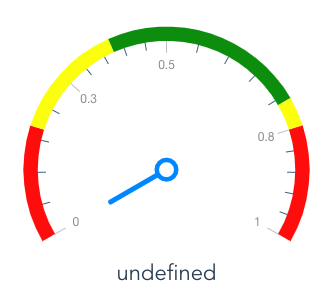
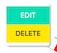
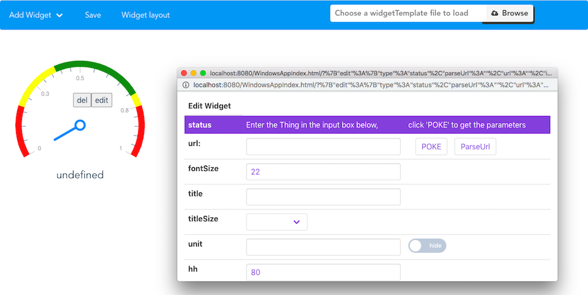
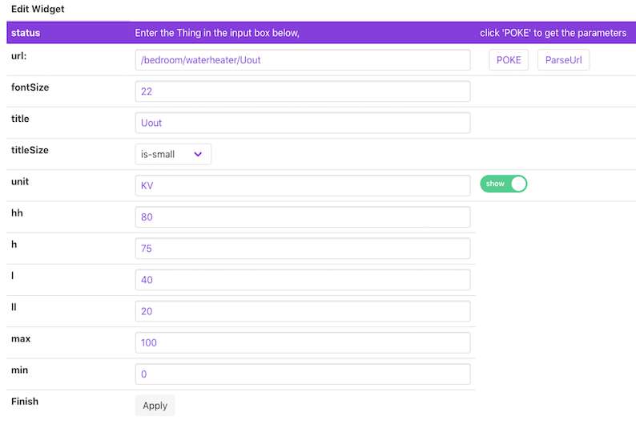
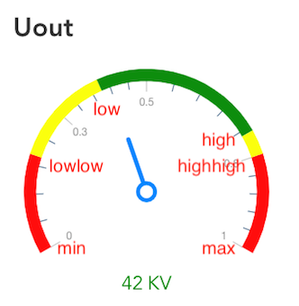
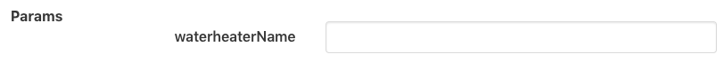
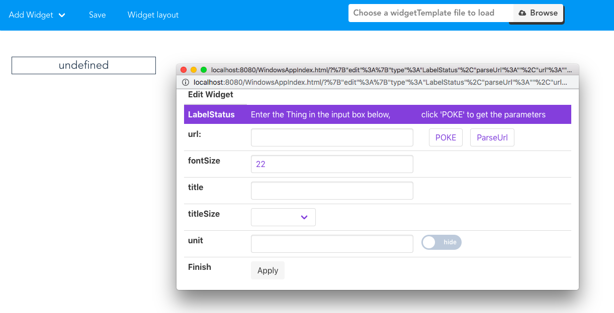
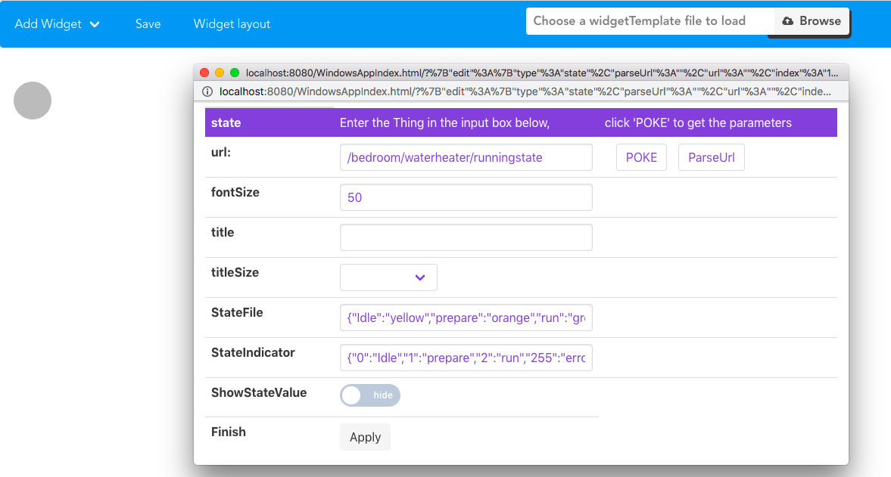
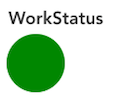

# Introduction of Status

## What is Status in CFET ?

CFET is designed to be a control systom based on the concept of 'Thing'. ``CFET abstractly encapsulates all objects to be controlled into things.`` And Status is a property of Things that cannot be changed and can only be read. It represent the current states of a thing that the thing wants others to know.

***For instance**, if the air conditioner is the object you want to control, so the air conditioner is the thing in CFET, and the status is the current state of the air conditioner, such as on or off.*

---

## Usage of Status
> There are many widgets used to display status, namely Status, Label, state and boolState.

所有States的widget目前都1s自动刷新一次资源，以轮询的方式感知服务器的变化
### Status

Status is a gauge, Suitable for displaying numbers.

At this time, the dashboard is still empty, App Developer can click the right mouse button on the gauge to wake up
the munu bar , select the edit button, the edit window will be called up to set the gauge.

`打开编辑窗口后，对应url的位置填写资源对应的http路径，比如你家的电器`

比如你要读the voltage value of the water heater in the beadroom.

像这样输入相应的路径，然后点击`POKE`,点击之后，下面会出现该路径对应的参数名以及输入框，在相应的参数名后面输入值，再点击Apply就完全了一次资源的访问。

It is worth noting that I, II, h, hh represent the scale division of the gauge

*Notes: The red font is just a comment of pic, not shown in the gauge*

> 进一步说明POKE的作用

假设房间里有热水器A和B。
你拿到一个路径：/bedroom/waterheater/Uout,你不知道有什么参数，或者不想手输参数，你可以点击POKE
然后对应的参数就会显示在页面下方，如：

输入A或者B，然后点击apply即可。

---

### LabelStatus

label和gauge的主题逻辑是一样的，用法也接近，不同的是，gauge对应的数据类型只能是数字或者数字的字符串，而label可以展示更多的数据

label的功能相对简单，没有ll hh那些配置，label可以说是最基础的widget

fontSize是字体大小，title是widget的标题，titleSize是标题大小，unit是单位
设置好了之后点击apply即可看到效果

---

### State

state是状态灯，对应的也是cfet中的status

目的是把资源，变成不同颜色的状态灯展示

如图，比如访问的资源是热水器的运行状态，资源返回的是0，1，2等等，直接这么展示，用户不明其意
这时候可以使用状态等，然后配置`StateFile`和`StateIndicator`，StateIndicator填的是，资源值对应状态名称，StateFile对应的是状态名称和颜色

颜色只要是html标准颜色就行，颜色名称和代码都可以，ShowStateValue代表需不需要显示状态名

比如后端告诉我，该资源值如果是2的话，就表示热水器处在正在运行状态，通过上图配置，给2取名为run，同时颜色是绿色
如果没有打开ShowStateValue，则主页上的状态灯此时就是绿色，如果打开了ShowStateValue，状态灯为绿色的同时，右边会显示状态名称run，告诉用户状态名

---

### BoolState

BoolState和State几乎一摸一样，是State的简化版，只支持红绿两种颜色
